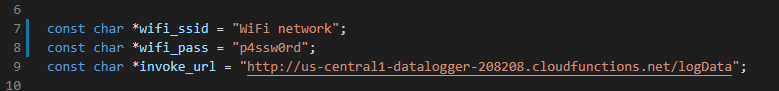

# Motherload Datalogger

The Master Datalogger Project, with Google Cloud Platform! Connect any sensor to the [XC4411](https://jaycar.com.au/p/XC4411) Uno with WiFi board, and log that data automatically to Google Sheets, with an SD card backup and Real Time Clock.


This project is designed to be open ended, so you can set it to interact with the web in any way you want. For our purposes, we will set it to upload data to google sheets.

## Table Of Contents

- [Motherload Datalogger](#Motherload-Datalogger)
  - [Table Of Contents](#Table-Of-Contents)
  - [Bill of Materials](#Bill-of-Materials)
  - [System Overview](#System-Overview)
    - [Important information](#Important-information)
  - [Programming and Platform setup](#Programming-and-Platform-setup)
    - [Setting up the Google Cloud Platform](#Setting-up-the-Google-Cloud-Platform)
      - [Building a Cloud function](#Building-a-Cloud-function)
      - [Bind Service worker to Google Sheets](#Bind-Service-worker-to-Google-Sheets)
    - [Program the ESP8266](#Program-the-ESP8266)
      - [How to program the device (for first timers)](#How-to-program-the-device-for-first-timers)
      - [Testing ESP8266 and Cloud Function](#Testing-ESP8266-and-Cloud-Function)
    - [Assemble the shield and set up RTC](#Assemble-the-shield-and-set-up-RTC)
      - [Soldering a row of header pins](#Soldering-a-row-of-header-pins)
      - [Programming the UNO portion of the code](#Programming-the-UNO-portion-of-the-code)
    - [Putting it all together](#Putting-it-all-together)
      - [Configuring the RTC for first time use](#Configuring-the-RTC-for-first-time-use)
  - [Explore](#Explore)
  - [Further Reading](#Further-Reading)

## Bill of Materials

| Qty | Code                                     | Description                   |
| --- | ---------------------------------------- | ----------------------------- |
| 1   | [XC4411](https://jaycar.com.au/p/XC4411) | Uno with WiFi                 |
| 1   | [XC4536](https://jaycar.com.au/p/XC4536) | Datalogging Shield            |
| 1   | [HM3211](https://jaycar.com.au/p/HM3211) | 28 Pin Terminal Strip         |
| 1   | [WC6026](https://jaycar.com.au/p/WC6026) | Socket to Socket Jumper Leads |
| 1   | [WH3032](https://jaycar.com.au/p/WH3032) | Breadboard Jumper Kit         |

Then you can get any arduino sensor that you want to data-log or perform actions for.

Some ideas include:

- [XC4494](https://jaycar.com.au/p/XC4494) or [XC3700](https://jaycar.com.au/p/XC3700) Temperature sensors
  - Log temperature from many different sources to monitor and track heat sources.
- [XC4610](https://jaycar.com.au/p/XC4610) current sensor
  - To track DC power usage in a power network.
- [XC4604](https://jaycar.com.au/p/XC4604) and [XC4520](https://jaycar.com.au/p/XC4520) Soil moisture and humidity sensors
  - To make your own greenhouse monitor or weather station.
- [ZD1904](https://jaycar.com.au/p/ZD1904) Pressure sensor
  - For home brewing or other water projects
- [XC3702](https://jaycar.com.au/p/XC3702) Barometric pressure sensor with [XC4518](https://jaycar.com.au/p/XC4518) UV sensor
  - Environmental monitoring.
- [XC4636](https://jaycar.com.au/p/XC4636) Fingerprint sensor and/or [XC4444](https://jaycar.com.au/p/XC4444)
  - For time-punching or other security ideas.

You could also add multiple [ZK8868](https://jaycar.com.au/p/ZK8868) chips to enable more analog ports if needed.

Or break the mould of thinking all together and use the [XC3712](https://jaycar.com.au/p/XC3712) GPS Module to send updates to your phone. The sky's the limit.

## System Overview


If you've tried using google sheets or a few other web-services in a project before, you'll notice that there's issues to do with logging into the service if it uses things like OAuth2 or other authentication methods.

This method outlined below makes it a simple task, as we set up what is called _cloud functions_ to activate and assign data to the google sheet on our behalf.

Here, we set a simple cloud function that is triggered by a web url, then you tell the ESP to upload data to that url, which in turn, goes through the cloud function to append data to the google sheet.

In essence, the cloud function looks like this:

```javascript
function main(urlData) {
  google
    .auth()
    .then(function() {
      //data from ESP when sent to this function
      api.spreadsheets.values.append(
        //add it to the spreadsheet
        {
          spreadsheetId: " ... ",
          values: urlData
        }
      );
    })
    .then(message => {
      respond.status(200).send(message); //if everything is all right, return HTTP 200
    })
    .catch(errorMessage => {
      respond.status(404).send(errorMessage); // else, send HTTP 404
    });
}
```

It might look like a foreign concept to you if you've never really dealt with anything like this before, but we'll walk through it step by step.

### Important information

Note that while Google Cloud Platform is a **paid service**, this tutorial will use free credits and will be in the free tier of the Google Cloud Platform. As of January 2020, the pricing is:

- Cloud Functions: _2 Million invocations a month for free_
- \$300 Credit for 1 year when you first sign up

This means you can upload 2 Million times in one month before you start to get charged for your use of a service.
This could change at any point and is not managed by us, so your best bet is to look at the following links to ensure that you're still within the free limits.

- [Google Cloud Platform General Pricing Information](https://cloud.google.com/pricing/)
- [GCP Cloud Function Pricing](https://cloud.google.com/functions/pricing)

Jaycar does not hold any responsibility for costs occurred by using the Google Cloud Platform (abbreviated as `GCP`). You are responsible for managing your costs and ensuring you are within the free limits, and by continuing with this tutorial you agree to be responsible for costs occurred.

Quick maths indicate uploading _every second_ of _every day_ will blow over the 2 million limit (2,500,000 invocations), so our code is set to upload data once a minute by default and we recommend that you don't reduce that without being sure of what you're doing.

## Programming and Platform setup

This section will assume you have already created a google spreadsheet to store data, If you haven't, head to [Google Sheets](https://sheets.google.com) and make a spreadsheet; You can put anything you want in this sheet; for simplicity, we will fill in the top row and simply append future data to the sheet.

### Setting up the Google Cloud Platform

First step is to head over to [console.cloud.google.com](https://console.cloud.google.com) and setting up your first project.

Each function and service on GCP must be tied to a _project_, this keeps all the resources that you use together so that you can easily tie multiple services together and not worry about one project's services utilising another.

For this tutorial, we will call our project "datalogger" but you can call it whatever. It might take a short while for the project to be created when you first make it, so go make a cup of tea and some toast while you wait. It should appear near the top of the page, next to "Google Cloud Platform" once it has loaded.

#### Building a Cloud function

Find "Cloud Functions" in the side menu, you can pin it to the top of the list to make it easier to find next time.


If you don't have a function it should present you with one button saying "create function" which you can click to bring you to this page:


We've split the image so that you can see all what's going on:

- Name the function something descriptive, without spaces. We've gone with `logData` as that is what the function will do.
- Memory Allocated: This function really doesn't need much, so go with 128MB. if you're expecting to send more data, bump this up.
- Trigger: we want to trigger with a HTTP request, which the URL is presented below (save this to put in the ESP later).
- Source code: you can just use the inline editor
- Runtime: We are using NodeJS for the code samples below, but you can also write python or `go` code if you want.

Copy and paste the below code for **index.js**

```javascript
const { google } = require("googleapis");

function append(api, data) {
  return new Promise((resolve, reject) => {
    api.spreadsheets.values.append(
      {
        spreadsheetId: process.env.SHEET,
        range: "A1:Z1",
        insertDataOption: "INSERT_ROWS",
        valueInputOption: "USER_ENTERED",
        resource: {
          values: [data]
        }
      },
      function(err, response) {
        if (err) {
          reject(err);
          return;
        }
        resolve(response);
        return;
      }
    );
  });
}
exports.main = (req, res) => {
  google.auth
    .getClient({
      scopes: ["https://www.googleapis.com/auth/spreadsheets"]
    })
    .then(auth => {
      const api = google.sheets({ version: "v4", auth });

      append(api, req.query.data || req.body.data || ["no", "data", "sent"])
        .then(e => {
          res.status(200).send(JSON.stringify(e, null, 2));
        })
        .catch(err => {
          res.status(404).send(JSON.stringify(err, null, 2));
        });
    });
};
```

Then copy and paste the below code for **package.json**

```json
{
  "name": "sample-http",
  "version": "0.0.1",
  "dependencies": {
    "googleapis": "^40.0.0"
  }
}
```

- _Function to execute_: In this function we called it "main" as denoted by the "exports" in code. change this to be `main`

Next up is important: expand the "environmental variables, networking, timeouts and more" line, so you get more advanced properties, and add an variable named "SHEET" containing your google Sheets ID, similar to below:


This is so that the function knows what sheet to access and add data to _(This is the sheet you will "share" with the service worker later)_.

Then press **Create** give it a a little while and it should deploy successfully. You should come to a screen like what is presented here: _(Note: we've cropped our image to make it fit on this page.)_


Two things to note here:

- Service worker: This is the "google account" that acts on behalf of the function, we'll use this below so copy it.
- Trigger tab: this shows you the URL used to trigger the function.

#### Bind Service worker to Google Sheets

In a new tab, head back to your google sheet that you want to add data to, and click the `Share` button, in the top right.

copy and paste the `service account` email address to the share link, and make sure that the permission is set to "Can Edit".


This is done on Google Sheets so when the function tries to edit, the sheets will allow it to come from your service worker. You can go back to your function properties and try to open the trigger url if you want; when you access it, you should get a row of data on your sheet that says `"No", "Data", "Sent"`.

### Program the ESP8266

There's two parts of code that you need to change for the esp code, found in `src/espCode/espCode.ino`:

- WiFi connection details
- Target URL, which is found from the _Function Properties_ as above, but with the `https://` replaced with `http://`.



We change it to `http` as dealing with SSL is a bit of a pain to do on the ESP8266. If you are up for a challenge, feel free to submit a pull request enabling `https://`, We'd love to see it!

Change the code to reflect your details and upload onto the ESP portion of the [XC4411](https://jaycar.com.au/p/XC4411).

If you've never used any ESP8266 device before, read the below section for a quick run-down on how to program.

#### How to program the device (for first timers)

If this is your first ESP8266 project ( products include [XC3802](https://jaycar.com.au/p/XC3802) and [XC4411](https://jaycar.com.au/p/XC4411), among others) then you need to set up Arduino to work with ESP8266. Start by getting the manual of the [XC3802](https://jaycar.com.au/p/XC3802) and install the board through the Boards manager.
Once they are installed, change the Board type to `Generic ESP8266` and change the dip-switches on the [XC4411](https://jaycar.com.au/p/XC4411) so that 5,6, and 7 are `ON` with all others off. When uploading, you might get to a point where it will output a string like `....______......____` - Press the reset button on the board to reboot it and program correctly.

When programming the arduino portion, change the dip-switches so that 3 and 4 are `ON` with 1,2,5,6, and 7 are `OFF`. Once both halves are programmed, you connect the two by turning all switches off and setting 1 and 2 to `ON`.

#### Testing ESP8266 and Cloud Function

Once the ESPCode is uploaded, you can turn dip-switch 7 `OFF` and open up the _Serial Monitor_. Set to the correct baud speed (default: 115200) and reset the device. You should see that it has connected to the WiFi network, and if you type in something such as:

```json
[1, 2, "This is a string", 4]
```

You will find this information has been uploaded onto your google spreadsheet. This means we're half-way there, and what's more is that it's a very simple process which might be starting to make sense to you; The ESP gets the serial data, and sends it to the URL; The Google Cloud function we made before then takes the data and adds it to your google sheet, as the service worker user, just as if someone else has added that data.

_Note, this is JSON data, so it must be properly formatted. In our code, we use the brilliant [ArduinoJSON](https://arduinojson.org/) library to parse everything correctly._

### Assemble the shield and set up RTC

Next up we'll discuss how to put the shield together. This shield has both an SD card slot and an RTC, which the code is provided in the `src/samples` folder. If you would like to use those parts of the shield, copy and paste from the relative example code.

We're going to add some header pins to the datalogging shield so it is easier to plug in sensors.

#### Soldering a row of header pins

First, trim off the amount of header pins that you want. We are going to make 2 rows of 11, which will act as our power rails, close to the `A0 - A5` analogue pins. This is for analogue modules that usually have the 3-cable connections (`5V`, `GND`, `Signal`).

Start by placing one row, and tack it in place at either end of the row.


then trim off a section of the [WH3032](https://jaycar.com.au/p/WH3032) solid core wire to be roughly the size of the row, with one end stripped, so that it can be soldered to one of the side tacks.


From here, you should be able to pull off the rest of the insulation to expose the bare wire. You can then trim this to size if needed, and press it up against the pins of the header row so that it sits touching the header pins.


From here, you can go along and solder the rest of the pins to the copper wire and make a nice solid connection.


Do this for both sides of the row, then use some more [WH3032](https://jaycar.com.au/p/WH3032) to solder these rows on to the 5V and GND connections. The goal here is to be neat and to leave room for future improvements if needed.

The analogue header row can be soldered in as normal, as each of the solder pads will already connect to the underlying arduino pins.

#### Programming the UNO portion of the code

Set dip-switches 3 & 4 to be `ON` and ensure the ESP switches (5,6,7) are turned `OFF`, then modify and upload the code found in `src/unoCode/unoCode.ino`

Our code already includes the latest version of `ArduinoJson`, so sending data becomes a breeze between the two modules.

```cpp
void setup(){
  Serial.begin(115200);
  // ... etc
}
void loop(){
  // get sensor reading, from A0 for instance:
  long value = analogRead(A0);

  //Build a JSON document, add the data, and send it.
  StaticJsonDocument<100> doc;
  doc.add(value);
  doc.add("some other values");
  doc.add( (float) 3.141527 ); //whatever values you want, but be sure to have the correct type.
  //calling serializeJson will send it over the Serial connection
  serializeJson(doc, Serial);

  delay(60 * 1000); // delay 60 seconds so we don't upload too much data.
}
```

Be sure to set the correct `data type` that you want to read from the sensor, and do any calculations before you finally add the data to the doc and send it.

For instance, if you wanted to calculate the average over the minute, or over 5 samples, or etc, you could do:

```cpp
long sum = 0;
// average over 5 samples:
for(int i = 0; i < 5; i++){
  sum += analogRead(A0); //add a reading to the total "sum"
  delay(1000); // wait 1 second between samples;
}
float average = sum / 5;

// ...
doc.add(average); //the data type is "float" so it will use decimal points.
// ... send it, and wait before sending more.
```

### Putting it all together

Check with the _Serial Monitor_ that the data comes in correctly formatted, on the same **Baud** as the ESP code portion (default: 115200). You should get readings in the form of `[1,2.00,43]` which is similar to what we tested with the ESP code above.

Here, the UNO is _sending_ the data, and the ESP _receives_ the data to upload to the cloud function.

Change dip-switches 1 and 2 to `ON` with all other dip-switches as `OFF` and reboot the device. With any luck, after a minute or two have passed you should be left with some data in your spreadsheet, corresponding to the data your arduino has sent


#### Configuring the RTC for first time use

If you would like to use the RTC to log time, upload the `src/samples/setRTC.ino` code onto the UNO portion of [XC4411](https://jaycar.com.au/p/XC4411). You should see the serial monitor display "OK"
and give you the current time as shown on your computer. Once that is done, you can simply add the RTC code to the above code sample.

We did not include it in the pre-programmed example as many datalogging shields are uninitialised and could cause hiccups for newcomers. Feel free to experiment in a "one way works for all" method and we could consider adding your code into the repository! :cheers:

## Explore

We've really intended this project to be as open ended as possible. Data can be copied to the SD card for backup, and the time from the RTC can be reported.

We hope you like this project and we're excited with any changes you guys might like to contribute, so be sure to check out the github page (link near the top of this page.) - plus if there's any issues you guys find or some further clarification needed, submit it on the _issues_ tab of the github page.

Google Cloud Functions really extend what is possible with these types of IoT projects and with enough elbow-grease you can do almost anything.

One idea is to upload GPS co-ordinates, which can send a link to google maps to your phone or email on those co-ordinates. doing something would be as simple as sending latitude and longitude data to your cloud function, then using the `MAPS` api to generate maps.


Have a look at some of the other apis and find a way to connect the API to new google cloud functions to be triggered by a HTTP request.

## Further Reading

The following links are not an endorsement nor have any guarantee of quality in terms of suitability for this project, but we hope they are useful for you in your maker journey.

- Writing Cloud Functions
  - <https://cloud.google.com/functions/docs/writing/http>
- Arduino Memory allocation (Good read!)
  - <https://cpp4arduino.com/2018/11/06/what-is-heap-fragmentation.html>
- Learn Javascript ( used by the google cloud function )
  - <https://www.javascript.com/try>
- Cloud function docs (Google)
  - <https://cloud.google.com/functions/docs/>
- What is `REST` api?
  - <https://restfulapi.net/>
- Google sheets api
  - <https://developers.google.com/sheets/api/>
